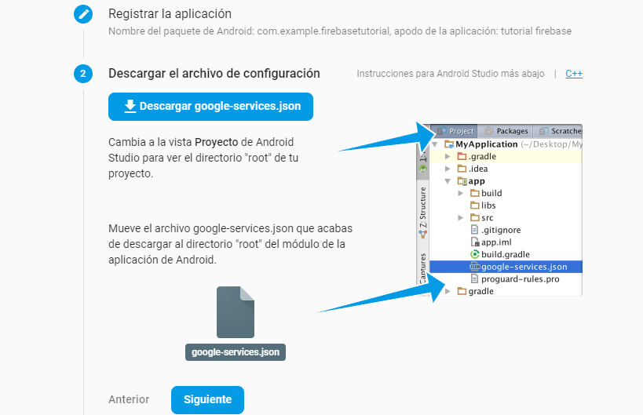
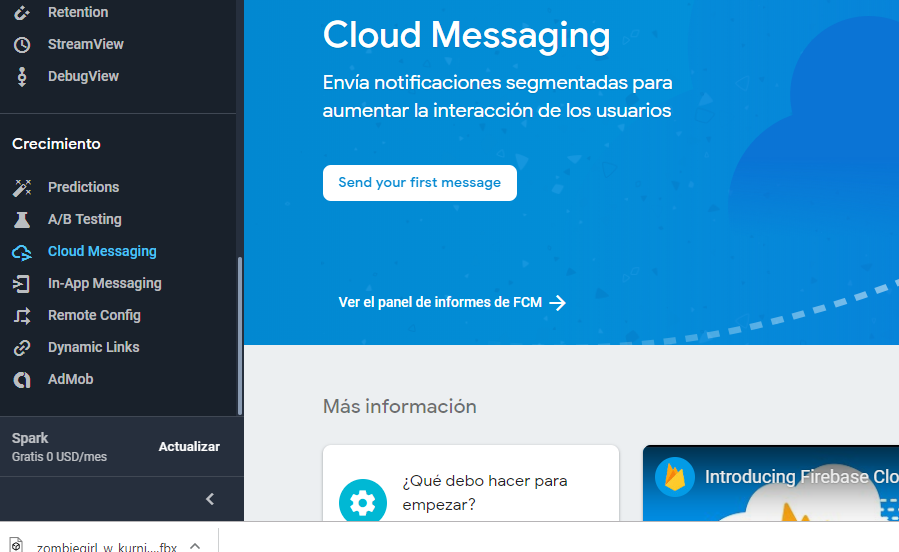
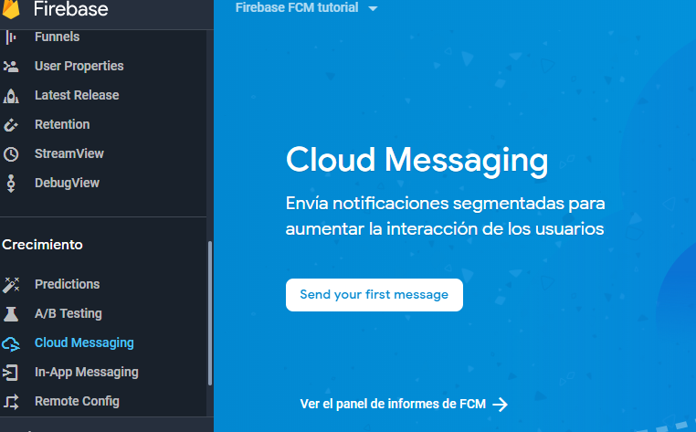

# Firebase Tutorial

## Configuración inicial
El primer paso es obtener un añadir un proyecto nuevo en firebase, [en la siguiente
URL](https://console.firebase.google.com)  y añadir un nuevo  proyecto. Aqui aparecerán
varios pasos a seguir<br><br>
<br>
De inmediato se te asigna un id de proyecto, el cual es muy importante, a continuaion se 
nos pide seleccionar una tecnología, seleccionamos Android<br>
<br><br>
En la siguiente ventana vamos a asignar el nombre del paquete de tu aplicación,el cual es
el nombre del id de tu proyecto cuando lo creaste en android studio, lo puedes 
ver en la el archivo gradle de nivel de modulo o en el nombre del paquete que se generó
en la main activity y que todas tus clases tendran. Es muy importante este paquete, ya que
firebase va a enlazar tu app directamente a este nombr y si no coincide lo recharzará
<br><br>
Despues oprimes el boton de Registrar aplicación y el siguente paso es el archivo
 JSON de descarga de google.services, este archivo lo descargas y te vas a la vista
 Project de Android Studio y alli pegas ese archivo json dentro de la carpeta 
 app d la vista de Project.<br><br>
 <br><br>
 Despues debes de añadir el SDK de firebase a tu proyecto: Primero a nivel de gradle de proyecto 
 vas a agregar<br><br>
 ```
 buildscript {
   dependencies {
     // Add this line
     classpath 'com.google.gms:google-services:4.2.0'
   }
 }
 ```
 
 Después en el gradle de nivel de módulo agregar la siguiente dependencia:
 ```
  implementation 'com.google.firebase:firebase-messaging:15.0.2'
    implementation 'com.google.firebase:firebase-core:15.0.2'
    implementation 'com.firebase:firebase-jobdispatcher:0.8.5'
 ```
 
 Hasta abajo de ese archivo de del build d nivel de modulo agregas<br>
 ```
  apply plugin: 'com.google.gms.google-services'
  ```
 Debemos postetiormente de esto,   generar las clases:<br><br>
 ** MyFirebaseMessaginfService
 ** MyFirebaseInstanceIDService
 ** MyJobService

Ahora el siguiente paso es agregar  los servicios d notificacion siguientes en el archivo
AndroidManifest.xml, esto lo debes agregar inmediatamente abajo de la etiqueta e cierre
de la activity de el manifest:
```
 <!-- Agregamos aqui la parte de el servicio de mensajeria -->
        <service android:name=".MyFirebaseMessagingService">
            <intent-filter>
                <action android:name="com.google.firebase.MESSAGING_EVENT"/>
            </intent-filter>
        </service>
        <service android:name=".MyFirebaseInstanceIDService">
            <intent-filter>
                <action android:name="com.google.firebase.INSTANCE_ID_EVENT"/>
            </intent-filter>
        </service>
        <service
            android:name=".MyJobService"
            android:exported="false">
            <intent-filter>
                <action android:name="com.firebase.jobdispatcher.ACTION_EXECUTE"/>
            </intent-filter>
        </service>
```
 Para verificar que todo esta bien, en es emiso archivo da clicl en la barira d Sync Now para 
 que verifiques que todo esta bien y que el proyecto descargo bien las dependencias.
 Le das click a siguiente y en ese ultimo paso se  comunicara de forma automatica la
 consola de firebase a tu app, este proceso tarda un poco. Puedes darle click al link de saltar este
  paso.<br><br>
  Despues en la siguiente ventana de firebase vas a encontrar del menu de la izquierda
   una opcion que dice Cloud Messaging, le das click en  esa opción, como se ilustra en la siguiente
    figura<br><br>
    
 
 Ahora el siguiente paso es generar un primer mensaje de envio, da click en "Send your 
 First Message" y sigue los pasos.<br><br>
  
 
 
 
 
 


