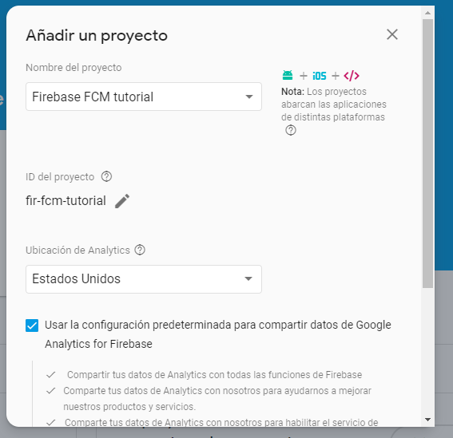
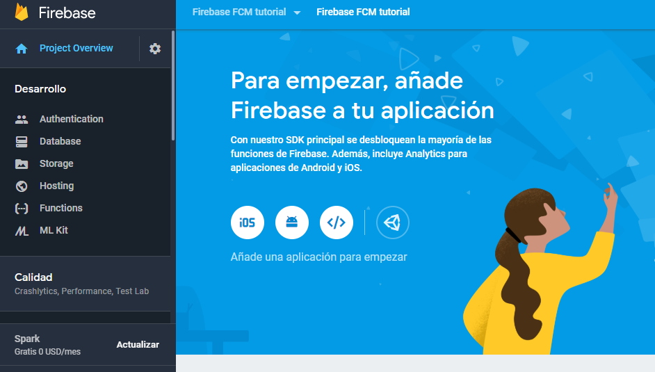
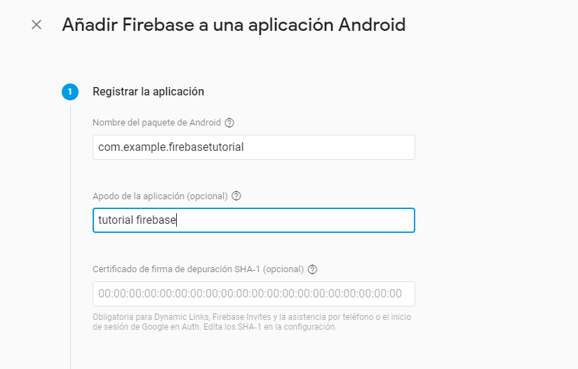

# Firebase Tutorial

## Configuración inicial
El primer paso es obtener un añadir un proyecto nuevo en firebase, [en la siguiente
URL](https://console.firebase.google.com)  y añadir un nuevo  proyecto.
 
De inmediato se te asigna un id de proyecto, el cual es muy importante, a continuaion se 
nos pide seleccionar una tecnología, seleccionamos Android 
  
En la siguiente ventana vamos a asignar el nombre del paquete de tu aplicación,el cual es
el nombre del id de tu proyecto cuando lo creaste en android studio, lo puedes 
ver en la el archivo gradle de nivel de modulo o en el nombre del paquete que se generó
en la main activity y que todas tus clases tendran. Es muy importante este paquete, ya que
firebase va a enlazar tu app directamente a este nombr y si no coincide lo recharzará
  

